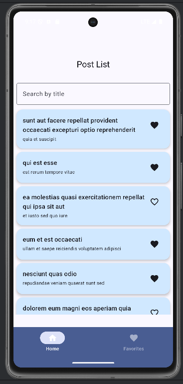
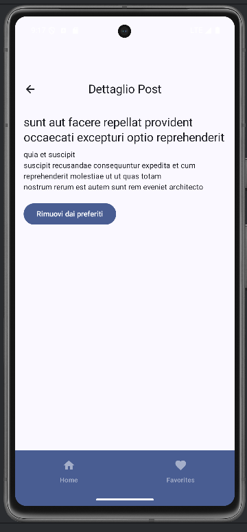
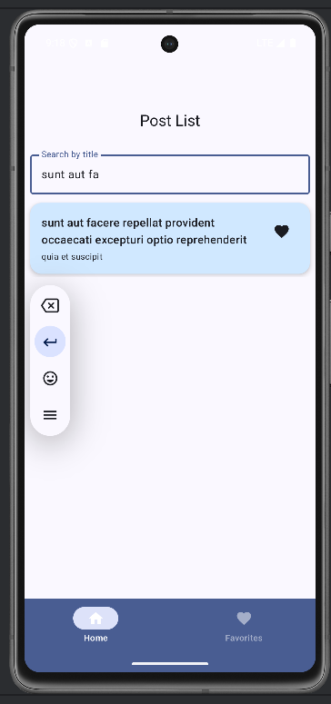

# 📱 ScrollApp
 
Una semplice app Android realizzata con Jetpack Compose, che mostra una lista di post recuperati da API REST. Gli utenti possono:

- filtrare i post per titolo

- visualizzare i dettagli

- aggiungere/rimuovere i post dai preferiti

- navigare tra Home e Preferiti tramite una BottomNavigation

# 📱 Anteprima

Ecco alcune schermate dell'app:

### 🏠 Lista dei Post (con ricerca e preferiti)


### 📄 Dettaglio di un Post


### 💜 Preferiti


### 🔍 Ricerca per Titolo



# 🔧 Tech Stack

- Jetpack Compose → per costruire l'intera interfaccia utente

- MVVM → architettura utilizzata

- ViewModel + StateFlow → gestione dello stato reattivo

- Room → per salvare localmente i post preferiti

- Retrofit → per effettuare chiamate HTTP verso un'API REST

- Navigation Component (Compose) → per navigare tra le schermate

- Material3 (Material You) → per UI moderna e componenti grafici

# 📡 API utilizzata

https://jsonplaceholder.typicode.com/posts

Restituisce una lista di post (id, title, body), usata per popolare la schermata iniziale.

# 📁 Struttura del progetto

```plaintext
com.example.postapps
├── data                 // Room + Models
│   ├── Post.kt
│   ├── FavoritePost.kt
│   ├── FavoritePostDao.kt
│   └── AppDatabase.kt
│
├── networks             // Retrofit
│   ├── PostService.kt
│   └── RetrofitInstance.kt
│
├── screen               // Compose UI
│   ├── PostListFragment.kt
│   ├── PostDetailFragment.kt
│   ├── FavoriteFragment.kt
│   ├── PostItem.kt
│   └── Mapper.kt (estensione: Post.toFavoritePost)
│
├── navigation           // Navigation Setup
│   ├── Screen.kt
│   └── appNavigation.kt
│
├── viewmodels           // ViewModel
│   ├── PostViewModel.kt
│
├── ui.theme             // Material Theme
│   ├── Color.kt
│   ├── Theme.kt
│   └── Type.kt
│
├── MainActivity.kt
├── PostViewModelFactory.kt
└── README.md ← 🟢 (questo file)
```


# 🧠 Funzionalità implementate

✅ Recupero post da API REST tramite Retrofit

✅ Salvataggio dei post preferiti su database locale (Room)

✅ UI reattiva con Jetpack Compose + StateFlow

✅ Ricerca testuale per titolo dei post

✅ BottomNavigation: Home e Preferiti

✅ Schermata dettaglio con bottone che cambia dinamicamente da “Aggiungi” a “Rimuovi dai preferiti”

✅ Icona "cuore" cliccabile anche da ogni card

✅ Styling moderno con Material3, colori personalizzati (azzurrino per le card, viola per la bottom bar)

# 📦 Dipendenze principali

Ecco le principali dipendenze che bisogna inserire nel libs.versions.toml:

```plaintext
toml
Copy
Edit
[versions]
compose = "1.5.0"
material3 = "1.1.2"
room = "2.6.1"
retrofit = "2.9.0"
kotlinx-coroutines = "1.7.3"
navigation = "2.7.5"
ksp = "1.9.21-1.0.15"

[libraries]
androidx-core = "androidx.core:core-ktx:1.12.0"
lifecycle-runtime = "androidx.lifecycle:lifecycle-runtime-ktx:2.6.2"
activity-compose = "androidx.activity:activity-compose:1.7.2"
material3 = "androidx.compose.material3:material3"
compose-ui = "androidx.compose.ui:ui"
compose-tooling = "androidx.compose.ui:ui-tooling-preview"

room-runtime = "androidx.room:room-runtime"
room-ktx = "androidx.room:room-ktx"
room-compiler = { module = "androidx.room:room-compiler", processor = "ksp" }

retrofit-core = "com.squareup.retrofit2:retrofit"
retrofit-gson = "com.squareup.retrofit2:converter-gson"

navigation-compose = "androidx.navigation:navigation-compose"

coroutines-core = "org.jetbrains.kotlinx:kotlinx-coroutines-core"
coroutines-android = "org.jetbrains.kotlinx:kotlinx-coroutines-android"
```

# 🏁 Come eseguire il progetto
Clona il repository

Assicurati di avere una connessione Internet attiva (l'app effettua richieste HTTP)

Avvia un emulatore Android

Esegui l'app da Android Studio

# 📝 Note finali
Il design è volutamente semplice ma modernizzato con colori e componenti Material.

Ottimo punto di partenza per app CRUD semplici o come test tecnico.

Estendibile facilmente con login, network retry, immagini ecc.
